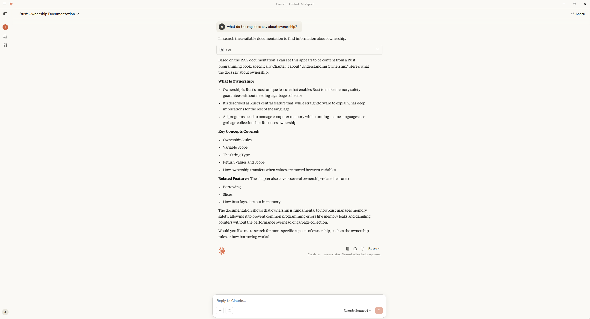

# rag-mcp-demo
This is an MVP to demo an MCP Server that provides RAG search over an existing index of documents (in this case The Rust Programming Language pdf) for use with an MCP host



To run on windows:
- uv venv
- .venv/Scripts/activate
- uv pip install -r requirements.txt
- uv run rag.py
- add rag to MCP Host's server config file

    For Cluade desktop:
    - code $env:AppData\Claude\claude_desktop_config.json
    - Add to "mcpServers":
    ```"rag": {
      "command": "uv",
      "args": [
        "--directory",
        "C:/Users/Aaron/repos/rag-mcp-demo",
        "run",
        "rag.py"
      ]
    }
- run Claude desktop
- rag should now appear in tools